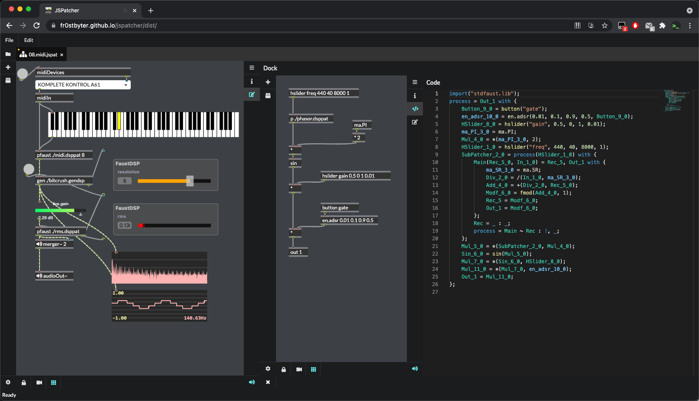

# JSPatcher

JSPatcher is a Visual Programming Language (VPL) in Max/PureData style on the web with following features:

- Patch WebAudio native AudioNodes
- Play with JavaScript Web APIs
- Import and patch external JavaScript modules
- Customize AudioWorklet DSPs with Faust

Video presentation [Link](https://youtu.be/HDijiua370I)

Web Audio Conference 2021 [Live Demo](https://fr0stbyter.github.io/jspatcher/dist/?projectZip=../examples/wac.zip)

### Related Paper

[Build WebAudio And JavaScript Web Application Using JSPatcher: A Web-Based Visual Programming Editor](https://webaudioconf2021.com/wp-content/uploads/2021/06/WAC-21-lite.pdf)